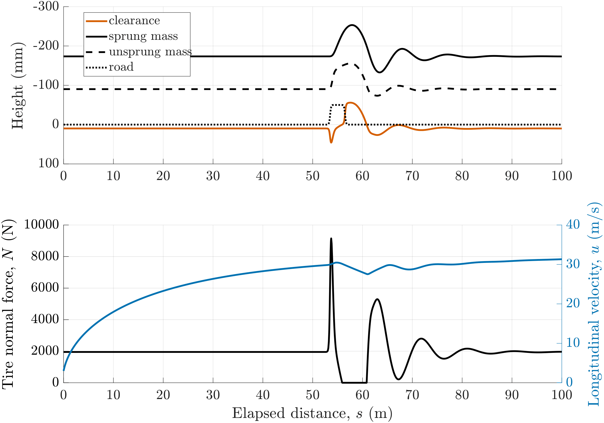

# Overview

| File | Description |
| --- | --- |
| `qc_bumpsMain.m` | RUN THIS. Main wrapper script where the appropriate scaling, bounds, and optimal control solution methods are declared. |
| `qc_bumpsContinuous.m` | Wrapper for `DAE.m` in an optimal control framework. |
| `qc_bumpsEndpoint.m` | Declares the integral to be minimized. |
| `qc_bumpsPlot.m` | Function that generates figures. |
| `Functions/` | Folder containing necessary supporting functions. |
| `Data/` | Folder containing necessary supporting data. |

The objective is to minimize the time taken to complete a 100 m distance with a bump along the way in an optimal control framework.
A secondary output of this work is to output the optimal damping stiffness to accomplish the very task.

The most important thing however, is to capture the dynamics of a tire leaving a road and coming back appropriately

# Dependencies

- MATLAB (license required)
- GPOPS2 (license required)
- derivative supplier: ADiGator (Can switch to sparseCD but increases computation time)

# Questions
Please contact me at r.lero@proton.me